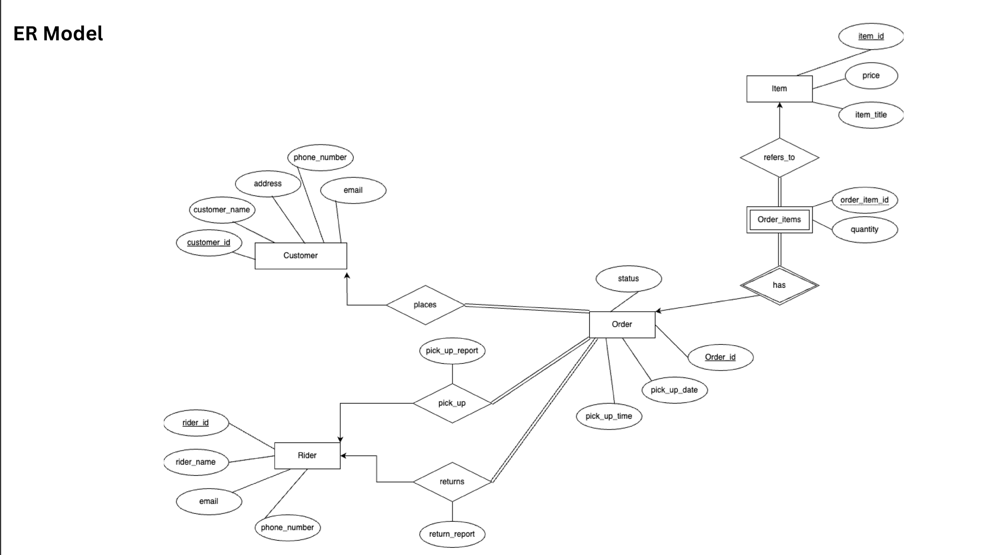
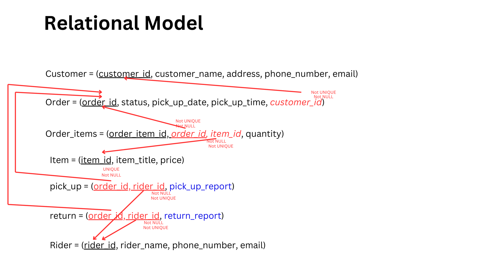

# SMART_CLEAN_PROJECT

## **Overview**

SMART_CLEAN_PROJECT is a database-centric application developed as part of a Database Systems Development class. The project integrates a well-designed relational database with a full-stack application, emphasizing database modeling, efficient SQL queries, and functional application development. The application facilitates door-to-door laundry services, enhancing customer convenience, efficient order management, and rider effectiveness.

---

## **Project Aims**

1. **Database Design**:
   - Develop comprehensive **Entity-Relationship (ER) models**.
   - Implement relational schema designs for optimized performance.
2. **SQL Development**:

   - Write and execute **SQL scripts** for creating, updating, and querying the database.
   - Ensure data consistency, integrity, and normalization.

3. **Application Development**:
   - Build a backend to interact with the database using SQL queries.
   - Create a user-friendly frontend to demonstrate database functionalities.

---

## **Features**

### **Customer Features**

- Register and log in to their profile.
- View and update their profile.
- Create orders by:
  - Selecting available time slots for pickup.
  - Specifying items for laundry with an approximate balance calculation.
- Track order progress.
- View order history.
- Cancel or modify orders before pickup.

### **Shop Features**

- Create and manage time slots for customer booking.
- Assign riders for pickups and deliveries.
- Manage orders through multiple stages:
  - Just Ordered
  - Rider Pickup
  - Laundry Processing
  - Delivery
- View and update rider details.
- Confirm payments and update order statuses.

### **Rider Features**

- View assigned orders for pickup or return.
- Update the status of orders during:
  - Pickup
  - Delivery
  - Completion
- Generate failure reports if unable to complete a pickup or delivery.
- Manage rider profiles, including updates and deletion.

---

## **Tech Stack**

### **Database**

- **PostgreSQL**:
  - Used as the primary relational database for the project.
  - Designed with relational models and optimized queries.

### **Backend**

- **Node.js**: JavaScript runtime for backend development.
- **Express.js**: Lightweight framework for RESTful API development.
- **PostgreSQL Client (`pg`)**: To interact with the database via SQL queries.
- **dotenv**: For secure environment variable management.
- **CORS**: For handling cross-origin requests.

### **Frontend**

- **React**:
  - JavaScript library for building the application’s user interface.
  - Includes routing for seamless navigation with **React Router**.
- **Axios**: For handling API requests to the backend.

---

## **Installation Instructions**

### **Step 1: Clone the Repository**

Clone the project repository to your local machine:

```bash
git clone <repository-url>
```

### **Step 2: Backend Setup**

1. Navigate to the backend directory:
   ```bash
   cd backend
   ```
2. Install dependencies:
   ```bash
   npm install
   ```
3. Set up environment variables:
   - Create a `.env` file in the `backend/` directory with the following:
     ```
     DB_USER=your_database_username
     DB_PASSWORD=your_database_password
     DB_HOST=localhost
     DB_PORT=5432
     DB_NAME=smartandclean
     ```
4. Execute the SQL scripts to set up the database.

5. Start the backend server:
   ```bash
   npm start
   ```

### **Step 3: Frontend Setup**

1. Navigate to the frontend directory:
   ```bash
   cd frontend
   ```
2. Install dependencies:
   ```bash
   npm install
   ```
3. Start the frontend:
   ```bash
   npm start
   ```

---

## **Database Development**

### **1. ER Diagram**

- The **Entity-Relationship (ER) diagram** represents the logical structure of the database, including entities, relationships, and cardinalities.

### **2. Relational Schema**

- The database schema is designed for normalization and optimal performance.

### **3. SQL Scripts**

- SQL scripts are included for:
  - **Database setup**: Table creation, constraints, and relationships.
  - **Data manipulation**: Insert, update, delete operations.
  - **Query optimization**: Complex SQL queries for retrieving and aggregating data.

---

## Database Design

### 1. ER Model

The Entity-Relationship (ER) model defines the structure and relationships of entities in the database. This model focuses on the logical organization of the data.



---

### 2. Relational Model

The Relational Model represents the database tables and their relationships, including attributes, primary keys, and foreign keys.



---

## **Folder Structure**

```plaintext
SMART_CLEAN_PROJECT-2/
├── backend/
│   ├── config/             # Database configuration
│   ├── controller/         # Business logic
│   ├── routes/             # API routes
│   ├── services/           # SQL queries
│   ├── tests/              # Test files
│   ├── sql/                # SQL scripts
│   ├── .env                # Environment variables
│   ├── package.json        # Backend dependencies
│   └── server.js           # Backend entry point
├── frontend/
│   ├── public/             # Static assets
│   ├── src/                # React source code
│   ├── package.json        # Frontend dependencies
├── README.md               # Project documentation
└── .gitignore              # Ignored files and folders
```

---

## **Future Improvements**

1. Add database transaction handling for better consistency.
2. Implement unit testing for database queries and APIs.
3. Enhance frontend visualizations for database interactions.
4. Deploy the application to a cloud platform.

---

## **License**

This project is licensed under the MIT License.
